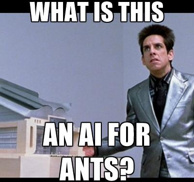

# AInts (WIP)

Screeps AI using ants and other social colony insects as a model.

## Searching

1. Place pheromones for last visited site
    - Reduced by steps taken since visiting the site
2. Take Action if near site
    - Transfer Energy
    - Harvest Energy
    - Upgrade Controller
3. Move if not taking action or fatigued
    - Chosen by highest level of pheromones being searched for and lowext level of pheromones being placed

## Spawning

- Single creep, capable of working and carrying
- No limit

## Room Updates (Weather)

- Pheromone decay

---

## Articles

- https://en.wikipedia.org/wiki/Ant
- [Swarm Intelligence](https://en.wikipedia.org/wiki/Swarm_intelligence)
- [Ant Colony Optimization](https://en.wikipedia.org/wiki/Ant_colony_optimization_algorithms)
- http://inspiringscience.net/2012/08/28/how-does-an-ant-colony-coordinate-its-behaviour/
- https://www.quantamagazine.org/20140409-the-remarkable-self-organization-of-ants/
- [A computational model of ant nest morphogenesis](https://mitpress.mit.edu/sites/default/files/titles/alife/0262297140chap61.pdf)
- http://www.techtimes.com/articles/7629/20140528/ants-forage-food-highly-efficient-systematic-way-study.htm
- [Chaos–order transition in foraging behavior of ants](https://www.ncbi.nlm.nih.gov/pmc/articles/PMC4060675/)
- [Learning Ant Foraging Behaviors](https://cs.gmu.edu/~eclab/papers/panait04learning.pdf)
- http://www.antwiki.org/wiki/Foraging_behaviors_in_Poneroids_and_Ectatomminae
- http://mute-net.sourceforge.net/howAnts.shtml
- http://natureofcode.com/book
- [Composite collective decision-making](https://www.ncbi.nlm.nih.gov/pmc/articles/PMC4590433/)
- http://www.huffingtonpost.com/marc-bekoff/study-rats-empathy_b_1138675.html
- [Structure and formation of ant transportation networks](http://rsif.royalsocietypublishing.org/content/8/62/1298)
- [The Regulation of Ant Colony Foraging Activity without Spatial Information](http://journals.plos.org/ploscompbiol/article?id=10.1371/journal.pcbi.1002670)
- [Ant colony optimization: Introduction and recent trends](https://www.ics.uci.edu/~welling/teaching/271fall09/antcolonyopt.pdf)
- [From Real to Artificial Ants](https://mitpress.mit.edu/sites/default/files/titles/content/9780262042192_sch_0001.pdf)
- [Ant Foraging Revisited](http://ai2-s2-pdfs.s3.amazonaws.com/0d92/349d41b77042a27e64526239198b2e117925.pdf)
- [Ant Algorithms for Discrete Optimization](https://www.cs.ubc.ca/~hutter/EARG.shtml/earg/papers04-05/artificial_life.pdf)

---

## Thanks

Forked with love from [screeps-typescript-starter](https://github.com/screepers/screeps-typescript-starter)

OS-style designed after [NhanHo/ScreepsOS](https://github.com/NhanHo/ScreepsOS)
